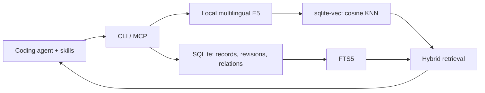

# RecallForge

**Local project memory for coding agents: remember the problem, the fix, and the evidence.**

RecallForge stores lessons, decisions, constraints, and patterns in SQLite, then retrieves them
through full-text and multilingual vector search. It ships a Rust CLI, a stdio MCP server,
and three portable agent skills. Markdown is an export format; the database is authoritative.



## What works

- **Structured evidence:** problem, cause, failed attempts, solution, verification, sources and applicability.
- **Local embeddings:** multilingual E5 small, 384 dimensions, through FastEmbed/ONNX. No API key or paid embedding service.
- **Hybrid search:** FTS5 + cosine KNN + reciprocal rank fusion. Query in Russian and retrieve an English lesson.
- **Project scope:** stable IDs and registered canonical roots, including multiple worktrees per project.
- **Lifecycle:** candidate, verified, stale, superseded. Inactive records are excluded by default.
- **Safe edits:** atomic record/FTS/vector changes, exact-content duplicate suppression, revision checks and history.
- **Relations:** `relates_to`, `caused_by`, `solved_by`, `supersedes`, with incoming/outgoing traversal.
- **Portability:** JSON/Markdown exports; SQLite online backups preserve records, relations, history and vectors.

## Install

Requirements: a current stable Rust toolchain (validated with Rust 1.98), a C toolchain,
and internet for the initial dependency/runtime/model downloads. macOS and Linux are CI targets.
Model weights are downloaded on the first semantic operation and then cached locally.

```bash
git clone https://github.com/xhqx/RecallForge.git
cd RecallForge
bash scripts/install.sh
```

The binary is installed to `~/.local/bin/recallforge`; add that directory to your PATH if necessary.
Override with `RECALLFORGE_BIN_DIR`. The installer does not change agent configuration.

```bash
recallforge init
recallforge project add --id example --name "Example app" --root /absolute/path/to/project
recallforge save --project example --file examples/test-container.json
recallforge search --project example --query "Тесты не видят зарегистрированный сервис"
recallforge doctor
```

Use the returned entry ID to fetch the full evidence:

```bash
recallforge get --project example --id ENTRY_UUID
recallforge history --project example --id ENTRY_UUID
```

`examples/test-container.json` is a **synthetic candidate**, not verified evidence about your project.

## Connect to Codex or another MCP host

```bash
codex mcp add recallforge -- /absolute/path/to/recallforge mcp
python3 scripts/install_skills.py
```

Restart/reload the host and verify that `project_list` and `memory_search` are available.
The skill installer refuses to replace an existing skill directory. Use `--destination` for
another host's skills folder. Other MCP clients can launch the same binary with `args: ["mcp"]`.

The supplied skills are:

| Skill | Purpose |
| --- | --- |
| `recallforge-recall` | Retrieve prior project evidence before investigating a problem |
| `recallforge-capture` | Save a useful finding promptly, with its verification state |
| `recallforge-promote` | Turn verified experience into a reviewable skill draft |

For ongoing capture, explicitly enable it for each project. A short project instruction can be:

> Use RecallForge for this registered project. Search relevant prior lessons before debugging.
> Save non-obvious findings while context is fresh; candidates remain unverified until checked.
> This authorizes local project-memory capture during development. Keep sources, failed attempts,
> and applicability. Draft skill changes for review unless installation is already authorized.

Skills rely on the agent invoking them. There is no background transcript scraper, compulsory
hook, or guarantee that every discovery is captured. See [workflow](docs/WORKFLOW.md).

## Storage and search

`recallforge init` prints the data directory. By default it is the OS application-data location,
outside the source repository. Set `RECALLFORGE_DATA_DIR` or `--data-dir` to choose another
dedicated private directory. On Unix, newly created data directories use 0700 and the database uses 0600.
Existing directory permissions are preserved.
Model weights use the OS cache directory (about 480 MiB for this model).
`RECALLFORGE_MODEL_CACHE` overrides this location and can share it between isolated databases.

The search pipeline prefilters by project and active status, retrieves lexical/vector candidates,
deduplicates document chunks, and combines ranks with RRF (`k=60`). Scores are relative ranks,
not probabilities or proof of correctness. Candidates are included and visibly labeled.
Results include a brief excerpt and source references; fetch the full entry before relying on it.

`sqlite-vec` performs **exact nearest-neighbor search**, not an approximate HNSW index.
This is a practical local baseline, not a claim of million-record scalability. Retrieval uses
a bounded candidate pool (20 × requested results, capped at 1000 chunks per branch).
Long records are chunked with overlap; many chunks from one record can reduce result diversity.
The default FTS tokenizer is Unicode-aware but does not provide Russian stemming.

```bash
# Full-text only: no embedding-model load or download.
recallforge save --project example --file finding.json --lexical-only
recallforge search --project example --query "ContainerMissingError" --mode lexical

# Build/rebuild embeddings, including previously lexical-only records.
recallforge reindex --project example

# Include old records explicitly; their status remains visible.
recallforge search --project example --query "old migration" --include-inactive
```

Semantic failures are reported explicitly; hybrid search never silently downgrades to lexical.
Lexical-only updates remove outdated vectors. Reindexing commits one entry at a time, checks
the revision before saving, and may be safely retried after a partial failure.

## Updating evidence and backing up

An update uses the complete entry payload plus `id` and `expected_revision`. Fetch first,
edit `data`, and add those fields. Omitted optional fields take their defaults; this is a full
replacement, not a patch. Revision conflicts never overwrite a newer record.

Verified entries require a solution, verification text and at least one source. The agent/human
must actually check that evidence: the database cannot determine whether a test truly ran.
Schema validation does not constitute independent verification. Near-duplicates are reviewed
by the capture skill; only exact-content duplicates are automatically suppressed.

A `supersedes` relation records a relationship; explicitly update the old entry's status to
`superseded` to remove it from normal retrieval. Existing history remains intact.

```bash
recallforge export --project example --format json > project-memory.json
recallforge export --project example --format markdown > project-memory.md
recallforge backup --output /private/backups/recallforge.db
```

Backups refuse existing destination files. To restore, stop clients and place a backup as
`memory.db` in a **new** dedicated data directory, then run `recallforge --data-dir DIR doctor`.
Do not copy a live SQLite file without its WAL; use the backup command. Model cache is separate
and can be downloaded again. JSON/Markdown exports are reading/interchange copies, not full
backup/restore archives; v0.1 has no import command.

## Privacy and limits

- Stored text is embedded locally. Downloads contact model/package registries; memory text is not sent to an embedding API.
- An agent may send retrieved text to its own model provider as part of its context.
- The database is **not encrypted at rest**. Use OS disk encryption when appropriate.
- Project IDs are a retrieval boundary, not authentication against a hostile local process.
- Memory content is untrusted reference data; it must never override user or system instructions.
- Publishing this repository does not publish runtime data. Never commit databases, model caches,
  credentials, personal memories or conversation logs.
- v0.1 is local and single-user. Multi-machine sync, a visual graph editor, automatic source-drift
  detection and large-scale ANN indexing are not implemented.

## Validate

```bash
cargo fmt --check
cargo clippy --all-targets -- -D warnings
cargo test
python3 scripts/smoke.py
RECALLFORGE_MODEL_CACHE=/path/to/model-cache cargo test --test semantic -- --ignored --nocapture
```

The network-dependent semantic test is opt-in. It checks six synthetic Russian queries against
English lessons; passing it is a smoke evaluation, not a broad retrieval-quality benchmark.
See [architecture](docs/ARCHITECTURE.md) and [verification](docs/VERIFICATION.md).

## License

MIT for RecallForge. Dependencies and model weights keep their own licenses.
Built with [SQLite](https://sqlite.org/), [sqlite-vec](https://github.com/asg017/sqlite-vec),
[FastEmbed](https://github.com/Anush008/fastembed-rs) and
[multilingual E5](https://huggingface.co/intfloat/multilingual-e5-small).
